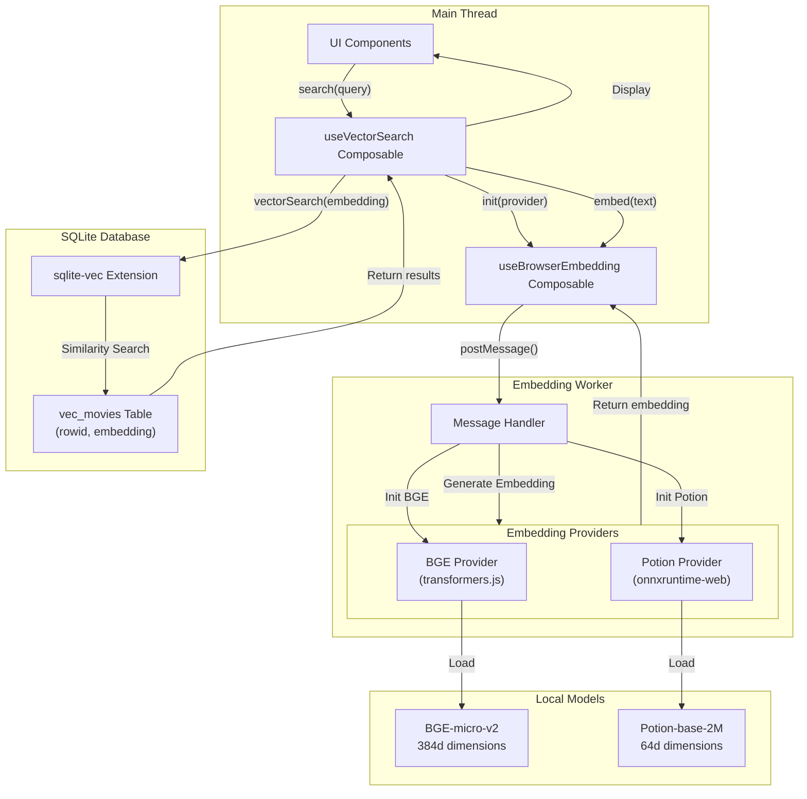
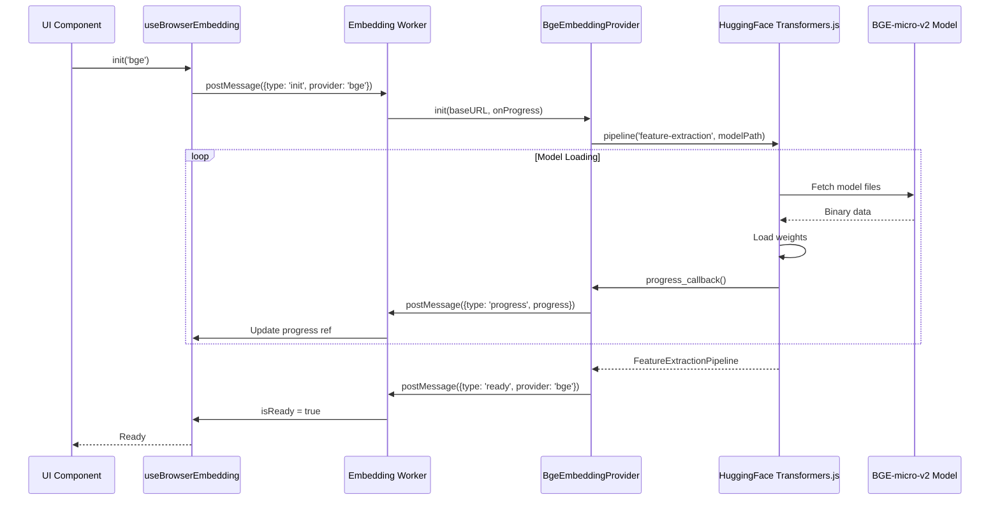
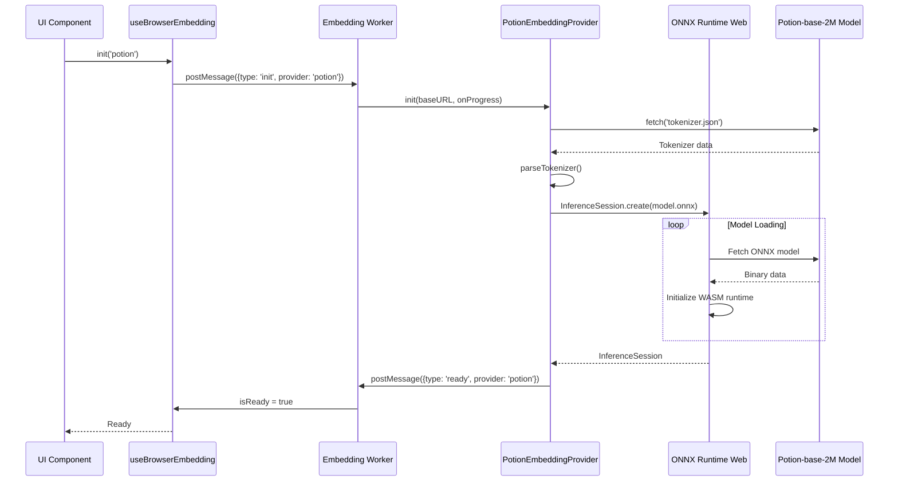
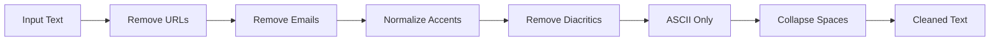
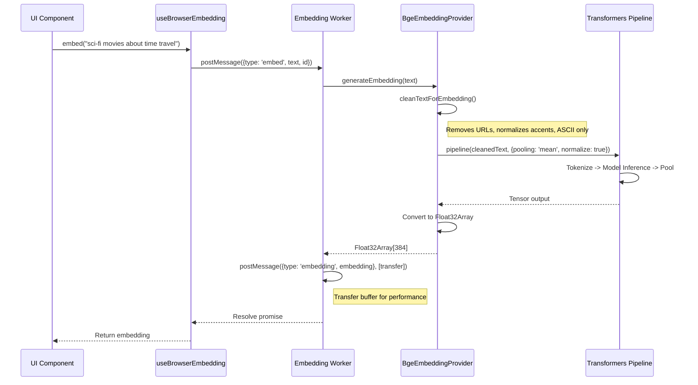
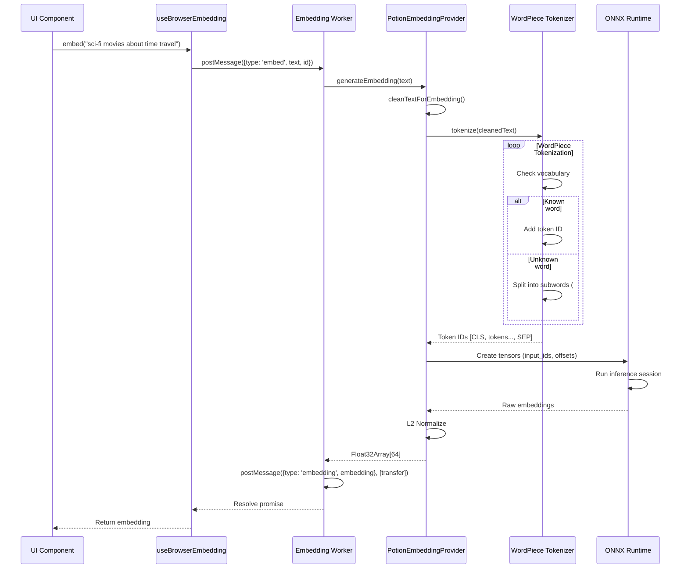
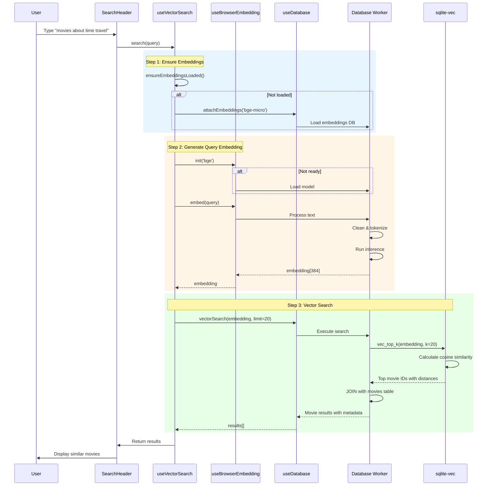
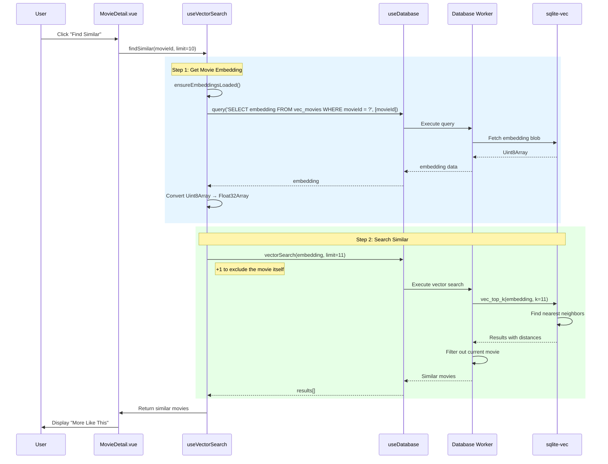
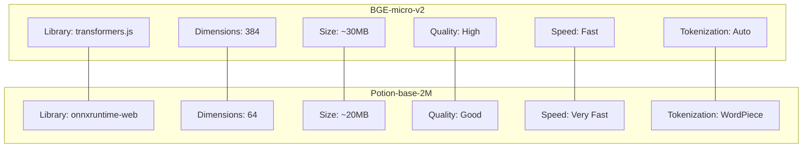
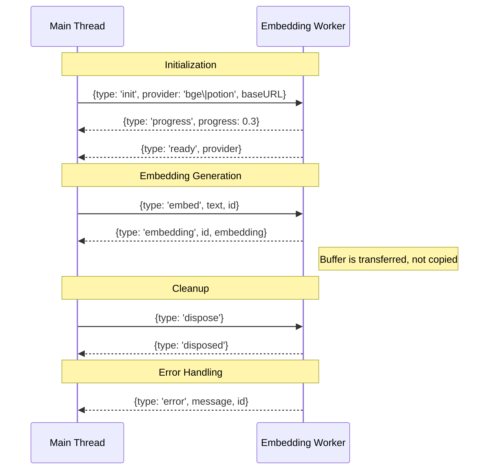

# Embedding Generation and Vector Search Architecture

## Overview

Movies Deluxe provides **semantic search** capabilities using embedding models that run directly in the browser. Two models are supported: **BGE-micro-v2** (384 dimensions) and **Potion-base-2M** (64 dimensions).

For model comparisons, dimensions, and database generation options, see **[Embedding Models](./embedding-models.md)**.

## Key Components

### 1. Embedding Worker

Runs in a separate Web Worker thread to avoid blocking the UI during model loading and inference.

### 2. Embedding Providers

Two providers implement the same interface:

- **BGE Provider**: Uses HuggingFace Transformers.js
- **Potion Provider**: Uses ONNX Runtime Web

### 3. Vector Search

Powered by **sqlite-vec** extension in the browser-based SQLite database.

## Architecture Flow



## Embedding Provider Initialization

### BGE Provider (Transformers.js)



### Potion Provider (ONNX Runtime)



## Text Preprocessing Pipeline

Both providers use the same text cleaning algorithm:



```javascript
function cleanTextForEmbedding(text) {
  return text
    .replace(/https?:\/\/[^\s]+/gi, '') // Remove URLs
    .replace(/www\.[^\s]+/gi, '') // Remove www links
    .replace(/bit\.ly\/[^\s]+/gi, '') // Remove short links
    .replace(/[\w.-]+@[\w.-]+\.\w+/g, '') // Remove emails
    .normalize('NFD') // Unicode normalization
    .replace(/[\u0300-\u036f]/g, '') // Remove combining marks
    .replace(/[^\x20-\x7E]/g, ' ') // ASCII only
    .replace(/\s+/g, ' ') // Collapse spaces
    .trim()
}
```

## Embedding Generation Flow

### BGE Generation



### Potion Generation



## Semantic Search End-to-End



## Find Similar Movies Flow



## Provider Comparison



| Feature             | BGE-micro-v2    | Potion-base-2M     |
| ------------------- | --------------- | ------------------ |
| **Dimensions**      | 384             | 64                 |
| **Model Size**      | ~30MB           | ~20MB              |
| **Library**         | transformers.js | onnxruntime-web    |
| **Quality**         | High            | Good               |
| **Inference Speed** | Fast            | Very Fast          |
| **Use Case**        | General search  | Fast mobile search |

## Message Protocol



## Performance Characteristics

| Operation            | BGE-micro-v2 | Potion-base-2M |
| -------------------- | ------------ | -------------- |
| Model Load           | 5-10 seconds | 3-5 seconds    |
| Embedding Generation | ~100ms       | ~50ms          |
| Vector Search        | ~20-50ms     | ~20-50ms       |
| Memory Usage         | ~50MB        | ~35MB          |

## File Structure

```
public/
├── models/
│   ├── bge-micro-v2/
│   │   ├── config.json
│   │   ├── model.safetensors
│   │   ├── tokenizer.json
│   │   └── tokenizer_config.json
│   └── potion-base-2M/
│       ├── config.json
│       ├── model.onnx
│       └── tokenizer.json
app/
├── workers/
│   └── embedding.worker.ts
├── composables/
│   ├── useBrowserEmbedding.ts
│   └── useVectorSearch.ts
├── utils/
│   └── embedding/
│       ├── bgeEmbedding.ts
│       └── potionEmbedding.ts
└── types/
    └── embedding.ts
```
