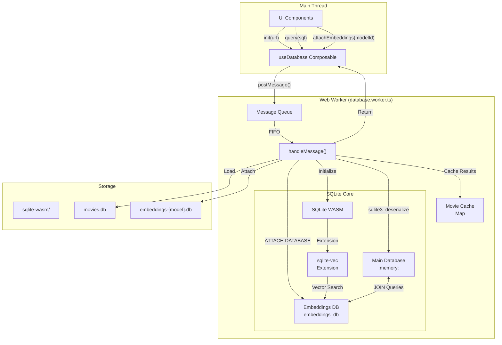
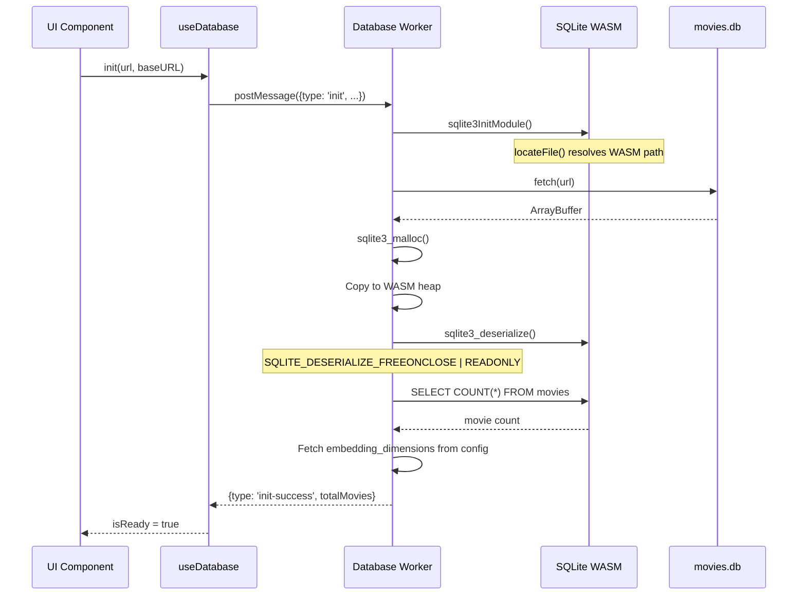
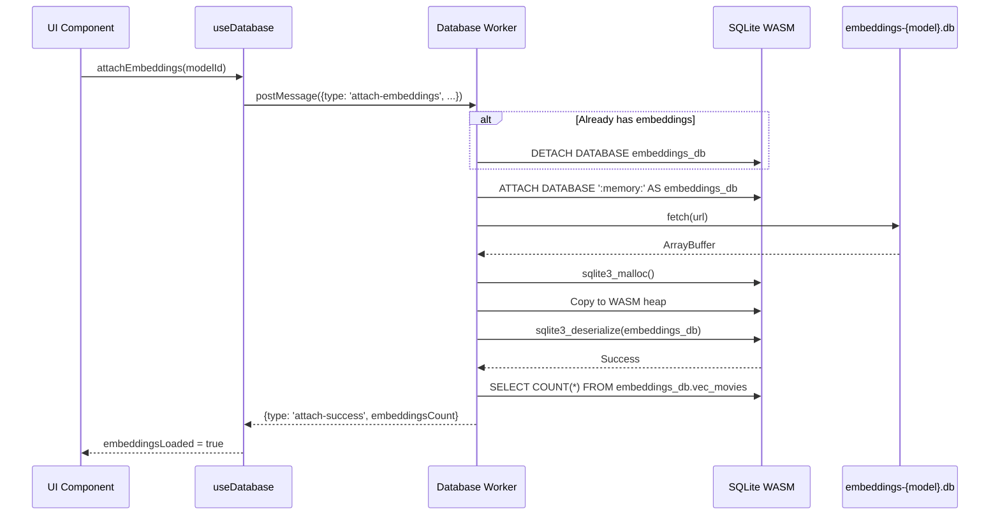
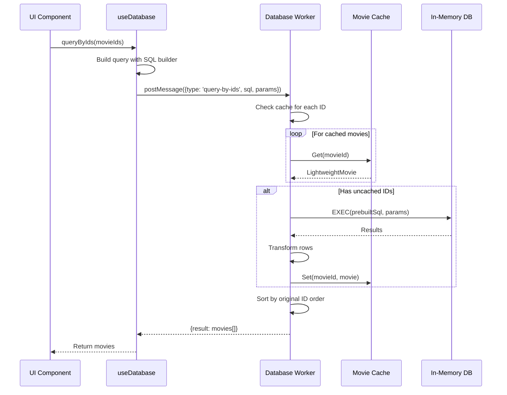
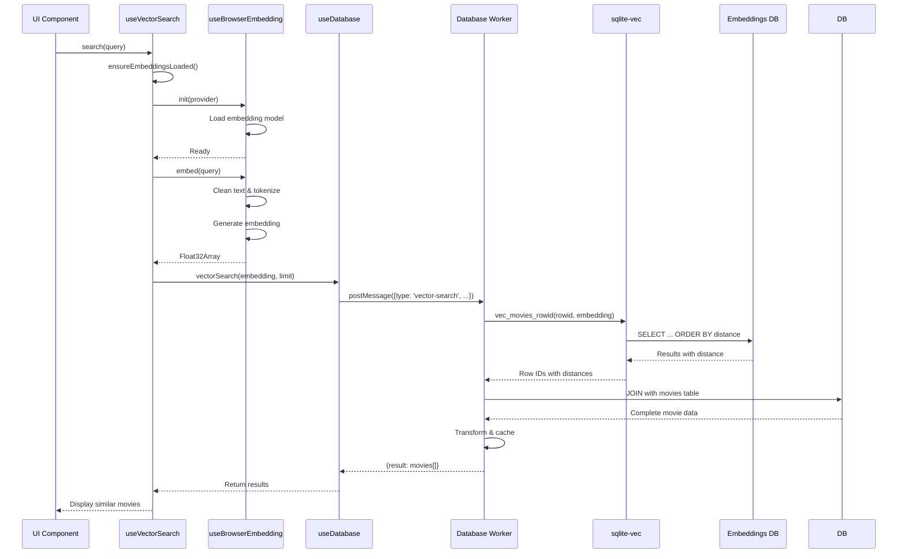
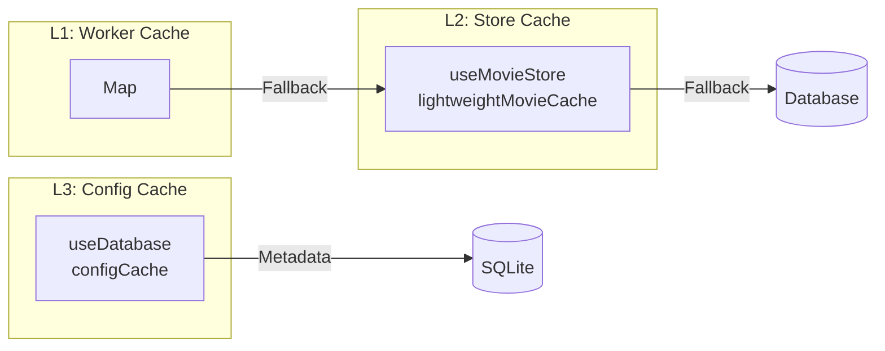
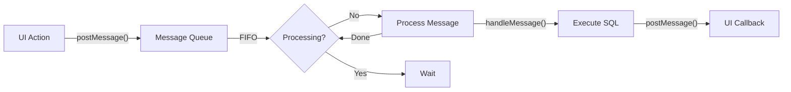

# SQLite Browser Architecture

## Overview

The Movies Deluxe application uses **SQLite WebAssembly** to run a full SQLite database directly in the browser. This provides fast, local-first querying without requiring a backend server.

## Key Components

### 1. SQLite WASM Module

The database is powered by `sqlite-wasm-vec`, a WebAssembly build of SQLite with the **sqlite-vec** extension for vector similarity search.

### 2. Database Worker

The `database.worker.ts` runs in a separate Web Worker thread to avoid blocking the main UI thread during heavy operations.

### 3. Attach/Detach Pattern

Embeddings are stored in a separate database file that can be dynamically attached and detached from the main database.

## Architecture Flow



## Initialization Flow



## Embeddings Attach/Detach Flow



## Query Execution Flow



## Vector Search Flow



## Caching Strategy

Three-level caching provides optimal performance:



| Cache Level | Location            | Purpose                       | Lifetime        |
| ----------- | ------------------- | ----------------------------- | --------------- |
| L1          | Database Worker     | Avoid re-querying same movies | Worker lifetime |
| L2          | Movie Store         | Reactive movie objects        | Page session    |
| L3          | Database Composable | Config/metadata               | Singleton       |

## Message Queue Pattern



The message queue ensures that database operations are processed sequentially, avoiding race conditions and maintaining data consistency.

## Performance Characteristics

- **Database Load**: ~1-2 seconds for main database (~200MB)
- **Embeddings Load**: ~0.5-1 seconds (~50-100MB)
- **Query Time**: <10ms for most queries
- **Vector Search**: ~20-50ms for similarity search
- **Cache Hit**: <1ms for cached movies

## File Structure

```
public/
├── sqlite-wasm/
│   ├── sqlite3.wasm          # SQLite WebAssembly binary
│   └── ...
├── data/
│   ├── movies.db             # Main movie database
│   ├── embeddings-bge-micro-movies.db
│   └── embeddings-potion-movies.db
app/
├── workers/
│   └── database.worker.ts    # Database Web Worker
├── composables/
│   └── useDatabase.ts        # Database composable
└── types/
    └── sqlite-wasm.ts        # TypeScript definitions
```
